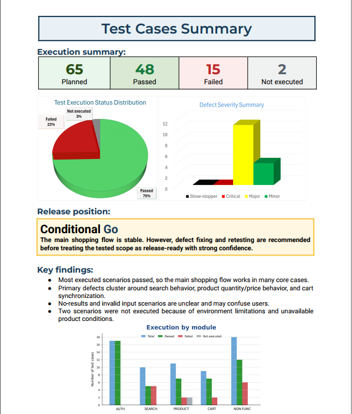
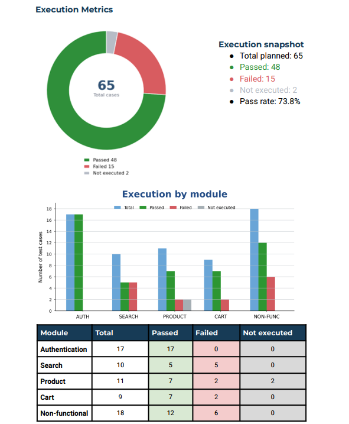
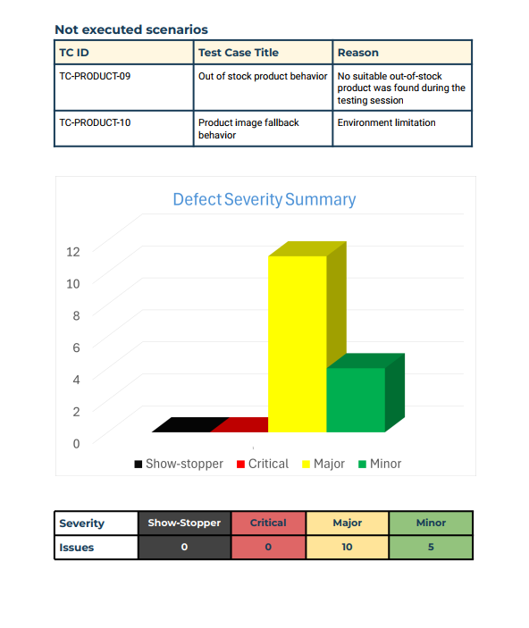
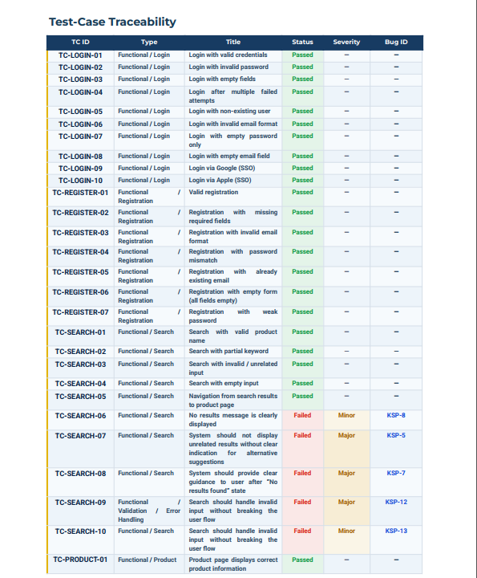

# KSP Website — Manual QA Project

End-to-end Manual QA project for the KSP e-commerce platform, covering core shopping flows through structured test design, execution, and defect analysis.

---

## 📋 Project Overview

| Field | Details |
|---|---|
| **System Under Test** | KSP Website — Core Shopping Flow |
| **Test Type** | Manual Functional + Non-Functional |
| **Environment** | Production |
| **Browsers Tested** | Chrome, Safari, Edge |
| **Prepared by** | Kirill Kovalevski |
| **Verified by** | Gal Matalon |

---

## 📊 Execution Summary

| Status | Count |
|---|---|
| ✅ Passed | 48 |
| ❌ Failed | 15 |
| ⏭️ Not Executed | 2 |
| 📋 Total Planned | 65 |

**Pass Rate: 73.8%**

---

## 🐛 Defect Summary

| Severity | Count |
|---|---|
| 🔴 Show-Stopper | 0 |
| 🟠 Critical | 0 |
| 🟡 Major | 10 |
| 🟢 Minor | 5 |

---

## 🧪 Modules Tested

| Module | Total | Passed | Failed | Not Executed |
|---|---|---|---|---|
| Authentication | 17 | 17 | 0 | 0 |
| Search | 10 | 5 | 5 | 0 |
| Product | 11 | 7 | 2 | 2 |
| Cart | 9 | 7 | 2 | 0 |
| Non-Functional | 18 | 12 | 6 | 0 |

---

## 🔍 Testing Areas

- Authentication & Registration
- Product Flow
- Search & Autocomplete
- Cart Functionality
- Session Handling
- Localization (I18N)
- Responsive Behavior
- Cross-browser Compatibility
- Performance Validation
- Security-related Scenarios
- Error Handling & Recovery

---

## 🛠️ QA Methodologies

- Positive / Negative Testing
- Boundary Value Analysis (BVA)
- Exploratory Testing
- Stateful Flow Testing
- Validation Testing
- Synchronization Testing
- Risk-based Testing

---

## 🧰 Tools Used

- Jira
- Google Chrome DevTools
- Google PageSpeed Insights

---

## 🚦 Release Position

> **Conditional Go** — The main shopping flow is stable. Defect fixing and retesting are recommended before treating the tested scope as release-ready with strong confidence.

---

## 📄 Full Documentation

[📥 Download Full STD & STR (PDF)](docs/KSP_Website_STD__STR__Kirill_Kovalevski.pdf)

---

## 📊 Test Execution Results

---

## 👤 Author Kirill kovalevski

**Kirill Kovalevski** — Manual QA Engineer
